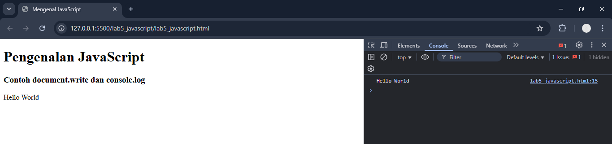
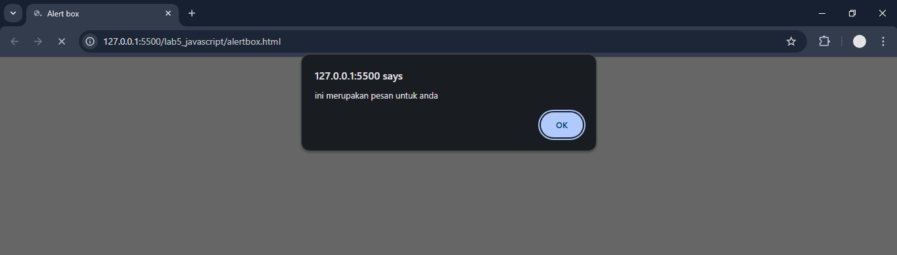

# Praktikum 5: JavaScript

### Nama      : Reynaldi Nugraha Putra
### Kelas     : TI.24.A.3
### Matakuliah: Pemrograman Web / Pert 5
___________________________________________________________________________________

#### 1. Pengenalan JavaScript `document.write` dan `console.log`
```
<!DOCTYPE html>
<html lang="en">

<head>
    <meta charset="UTF-8">
    <meta name="viewport" content="width=device-width, initial-scale=1.0">
    <title>Mengenal JavaScript</title>
</head>

<body>
    <h1>Pengenalan JavaScript</h1>
    <h3>Contoh document.write dan console.log</h3>
    <script>
        document.write("Hello World");
        console.log("Hello World");
    </script>

</body>

</html>
```

Output:

<br>

#### 2. JavaScript Alert Box
```
<html>

<head>
    <title>Alert box </title>
</head>

<body>
    <script language="javascript">
        <!--
        window.alert("ini merupakan pesan untuk anda");
        //-->
    </script>
</body>

</html>
```

Output:

<br>
