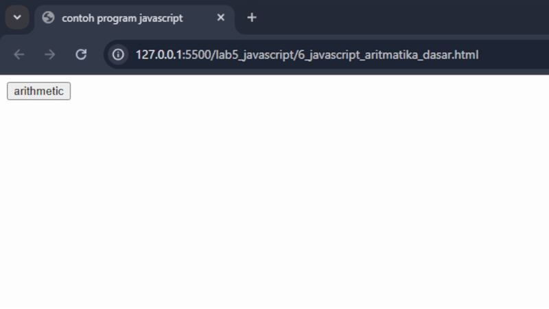
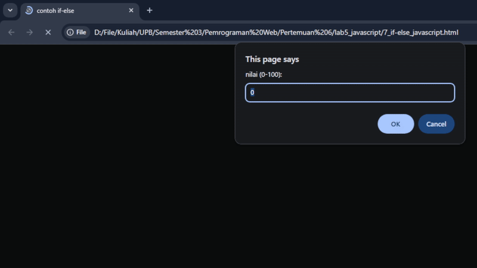
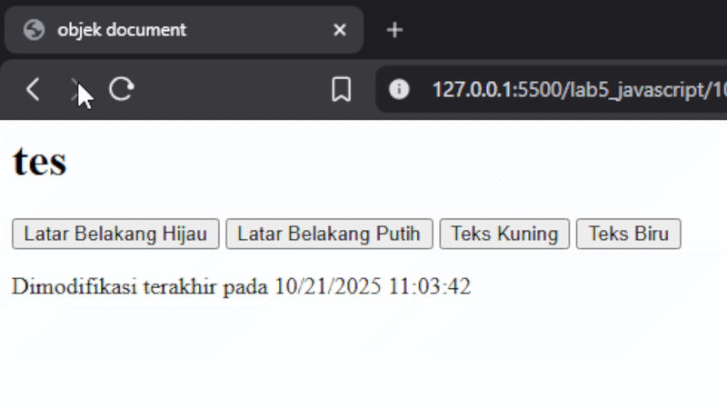

# Praktikum 5: JavaScript

### Nama      : Reynaldi Nugraha Putra
### Kelas     : TI.24.A.3
### Matakuliah: Pemrograman Web / Pert 5
___________________________________________________________________________________

### 1. Pengenalan JavaScript `document.write` dan `console.log`
```
<!DOCTYPE html>
<html lang="en">

<head>
    <meta charset="UTF-8">
    <meta name="viewport" content="width=device-width, initial-scale=1.0">
    <title>Mengenal JavaScript</title>
</head>

<body>
    <h1>Pengenalan JavaScript</h1>
    <h3>Contoh document.write dan console.log</h3>
    <script>
        document.write("Hello World");
        console.log("Hello World");
    </script>

</body>

</html>
```

Output:

<br>

### 2. JavaScript Alert Box
```
<html>

<head>
    <title>Alert box </title>
</head>

<body>
    <script language="javascript">
        <!--
        window.alert("ini merupakan pesan untuk anda");
        //-->
    </script>
</body>

</html>
```

Output:

<br>

### 3. Skrip JavaScript `document.write`
```
<html>

<head>
    <title>skrip javascript</title>
</head>

<body>
    percobaan memakai javascript:<br>
    <script language="javascript">
        <!--
        document.write("selamat mencoba javascript<br>");
        document.write("semoga sukses!");
        //-->
    </script>
</body>

</html>
```

Output:

<br>

### 4. JavaScript Input Data `var nama = prompt("")`
```
<html>

<head>
    <title>pemasukan data</title>
</head>

<body>
    <script language="javascript">
        <!--
        var nama = prompt("siapa nama anda?", "masukkan nama anda");
        document.write("hai, " + nama);
        //-->
    </script>
</body>

</html>
```

Output:

<p align="center"> gambar input data </p>
<br>
<br>


<p align="center"> gambar output data </p>

### 5. JavaScript `alert` dan `onload`
```
<html>

<head>
    <title>contoh program javascript</title>
    <script language="javascript">
        function pesan() {
            alert("memanggil javascript lewat body onload")
        }
    </script>
</head>

<body onload=pesan()>
</body>

</html>
```

Output:

<br>

### 6. Program JavaScript Aritmatika Dasar
```
<html>

<head>
    <title>contoh program javascript</title>

    <script language="javascript">
        function test(val1, val2) {
            document.write("<br>*perkalian : val1*val2 " + "<br>");
            document.write(val1 * val2);
            document.write("<br>/pembagian : val1/val2 " + "<br>");
            document.write(val1 / val2);
            document.write("<br>+penjumlahan : val1+val2 " + "<br>");
            document.write(val1 + val2);
            document.write("<br>-pengurangan : val1-val2 " + "<br>");
            document.write(val1 - val2);
            document.write("<br>%modulus : val1%val2 " + "<br>");
            document.write(val1 % val2);
        }
    </script>
</head>

<body>
    <input type="button" name="button1" value="arithmetic" onclick="test(9,4)">
</body>

</html>
```

Output:

<br>

### 7. JavaScript if-else
```
<html>

<head>
    <title>contoh if-else</title>
</head>

<body>

    <script language="javascript">
        <!--
        var nilai = prompt("nilai (0-100): ", 0);
        var hasil = "";
        if (nilai >= 60)
            hasil = "lulus";
        else
            hasil = "tidak lulus";
        document.write("hasil: " + hasil);
        //-->
    </script>

</body>

</html>
```

Output:

<br>

### 8. Program JavaScript Input Bilangan
```
<html>

<head>
    <title>contoh program javascript</title>

    <script language="javascript">
        function test() {
            val1 = window.prompt("input nilai (1-5):")
            switch (val1) {
                case "1":
                    document.write("bilangan satu")
                    break
                case "2":
                    document.write("bilangan dua")
                    break
                case "3":
                    document.write("bilangan tiga")
                    break
                case "4":
                    document.write("bilangan empat")
                    break
                case "5":
                    document.write("bilangan lima")
                    break
                default:
                    document.write("bilangan lainnya")
            }
        }
    </script>
</head>

<body>
    <input type="button" name="button1" value="switch" onclick="test()">
</body>

</html>
```

Output:

<br>

### 9. Program JavaScript Bilang Ganjil-Genap
```
<html>

<head>
    <script language="javascript">
        function test() {
            var val1 = document.kirim.T1.value
            if (val1 % 2 == 0)
                document.kirim.T2.value = "bilangan genap"
            else
                document.kirim.T2.value = "bilangan ganjil"
        }
    </script>
</head>

<body>
    <form method="POST" name="kirim">
        <p>BIL <input type="text" name="T1" size="20"> MERUPAKAN BIL <input type="text" name="T2" size="20"></p>
        <p><input type="button" value="TEBAK" name="B1" onclick=test()></p>
    </form>
</body>

</html>
```

Output:

<br>

### 10. Program JavaScript Form Button
```
<html>

<head>
    <title>objek document</title>
</head>

<body>
    <script language="javascript">
        <!--
        function ubahWarnaLB(warna) {
            document.bgColor = warna;
        }

        function ubahWarnaLD(warna) {
            document.fgColor = warna;
        }
        //-->
    </script>
    <h1>tes</h1>
    <form>
        <input type="button" value="Latar Belakang Hijau" onClick="ubahWarnaLB('GREEN')">
        <input type="button" value="Latar Belakang Putih" onClick="ubahWarnaLB('WHITE')">
        <input type="button" value="Teks Kuning" onClick="ubahWarnaLD('YELLOW')">
        <input type="button" value="Teks Biru" onClick="ubahWarnaLD('BLUE')">
    </form>
    <script language="javascript">
        <!--
        document.write("Dimodifikasi terakhir pada " + document.lastModified);
        //-->
    </script>
</body>

</html>
```

Output:

<br>

### 11. Program JavaScript Check Box
```
<!--
File: daftar_menu.html
-->
<html>

<head>
    <title>Daftar Menu</title>
    <script>
        function hitung(ele) {
            var total = document.getElementById('total').value;
            total = (total ? parseInt(total) : 0);
            var harga = 0;

            if (ele.checked) {
                harga = ele.value;
                total += parseInt(harga);
            } else {
                harga = ele.value;
                if (total > 0)
                    total -= parseInt(harga);
            }

            document.getElementById('total').value = total;
        }
    </script>
</head>

<body>
    <h3>Daftar Menu Makanan</h3>
    <label><input type="checkbox" value="5000" id="menu1" onClick="hitung(this);"/> Ayam Goreng Rp. 5.000</label><br />
    <label><input type="checkbox" value="500" id="menu2" onClick="hitung(this);"/> Tempe Goreng Rp. 500</label><br />
    <label><input type="checkbox" value="2500" id="menu3" onClick="hitung(this);"/> Telur Dadar Rp. 2.500</label><br />
    <strong>Total Bayar: Rp. <input id="total" type="text" /></strong>
</body>

</html>
```

Output:

<br>


##Pertanyaan dan Tugas
### 1. Buat script untuk melakukan validasi pada isian form.
   
```
<!DOCTYPE html>
<html lang="id">

<head>
    <meta charset="UTF-8">
    <meta name="viewport" content="width=device-width, initial-scale=1.0">
    <title>Validasi Form</title>
    <script>
        function validateForm() {
            let nama = document.forms["formData"]["nama"].value;
            let email = document.forms["formData"]["email"].value;
            let umur = document.forms["formData"]["umur"].value;
            let pesan = "";

            if (nama == "") {
                pesan += "- Nama tidak boleh kosong\n";
            }
            if (email == "") {
                pesan += "- Email tidak boleh kosong\n";
            } else if (!email.includes("@")) {
                pesan += "- Format email tidak valid\n";
            }
            if (umur == "" || isNaN(umur)) {
                pesan += "- Umur harus berupa angka\n";
            } else if (umur < 17) {
                pesan += "- Umur minimal 17 tahun\n";
            }

            if (pesan != "") {
                alert("Terjadi kesalahan:\n" + pesan);
                return false; // menghentikan submit
            }
            alert("Form berhasil dikirim!");
            return true;
        }
    </script>
</head>

<body class="bg-gray-100 p-6">
    <h2>Form Pendaftaran</h2>
    <form name="formData" onsubmit="return validateForm()">
        <label>Nama:</label><br>
        <input type="text" name="nama"><br><br>

        <label>Email:</label><br>
        <input type="text" name="email"><br><br>

        <label>Umur:</label><br>
        <input type="text" name="umur"><br><br>

        <input type="submit" value="Kirim">
    </form>
</body>

</html>
```
Output:

<br>
