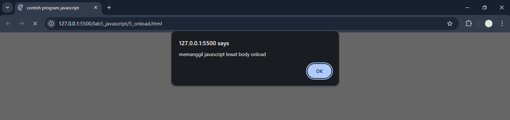

# Praktikum 5: JavaScript

### Nama      : Reynaldi Nugraha Putra
### Kelas     : TI.24.A.3
### Matakuliah: Pemrograman Web / Pert 5
___________________________________________________________________________________

#### 1. Pengenalan JavaScript `document.write` dan `console.log`
```
<!DOCTYPE html>
<html lang="en">

<head>
    <meta charset="UTF-8">
    <meta name="viewport" content="width=device-width, initial-scale=1.0">
    <title>Mengenal JavaScript</title>
</head>

<body>
    <h1>Pengenalan JavaScript</h1>
    <h3>Contoh document.write dan console.log</h3>
    <script>
        document.write("Hello World");
        console.log("Hello World");
    </script>

</body>

</html>
```

Output:

<br>

#### 2. JavaScript Alert Box
```
<html>

<head>
    <title>Alert box </title>
</head>

<body>
    <script language="javascript">
        <!--
        window.alert("ini merupakan pesan untuk anda");
        //-->
    </script>
</body>

</html>
```

Output:

<br>

#### 3. Skrip JavaScript `document.write`
```
<html>

<head>
    <title>skrip javascript</title>
</head>

<body>
    percobaan memakai javascript:<br>
    <script language="javascript">
        <!--
        document.write("selamat mencoba javascript<br>");
        document.write("semoga sukses!");
        //-->
    </script>
</body>

</html>
```

Output:

<br>

#### 4. JavaScript Input Data `var nama = prompt("")`
```
<html>

<head>
    <title>pemasukan data</title>
</head>

<body>
    <script language="javascript">
        <!--
        var nama = prompt("siapa nama anda?", "masukkan nama anda");
        document.write("hai, " + nama);
        //-->
    </script>
</body>

</html>
```

Output:

<p align="center"> gambar input data </p> 


<p align="center"> gambar output data </p>

#### 5. JavaScript `alert` dan `onload`
```
<html>

<head>
    <title>contoh program javascript</title>
    <script language="javascript">
        function pesan() {
            alert("memanggil javascript lewat body onload")
        }
    </script>
</head>

<body onload=pesan()>
</body>

</html>
```

Output:

<br>
